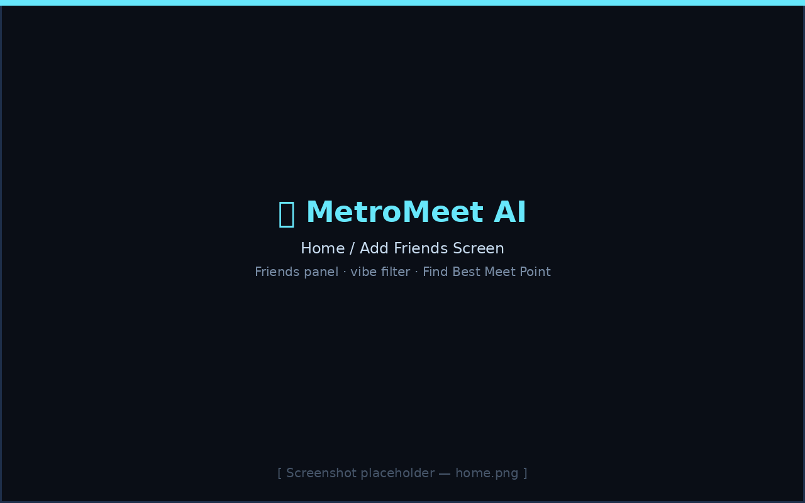

<div align="center">

<!-- Project banner placeholder — replace with a real banner image, e.g. docs/screenshots/banner.png -->


# 🚇 MetroMeet AI

**A fairness-first meetup planner for the Bangalore Namma Metro.**
Find the station where *nobody* has to travel unfairly far — with a live
schematic map, a context-aware AI assistant, and real nearby-hangout data.

[](LICENSE)
[](docs/deployment.md)
[](docs/diagnostics.md)
[](package.json)
[](https://vercel.com/new)
[](CONTRIBUTING.md)


</div>

---

## Overview

You and five friends are scattered across Bangalore's Namma Metro network and
want to meet up. Who has to travel the furthest? Which station is actually
*fair* to everyone — not just the one with the lowest total travel time?
Is there anywhere decent to hang out near it?

**MetroMeet AI answers all three at once.** Add your friends' home stations,
pick a vibe (cafe, mall, park, bar…), and it finds the meetup point that
minimizes the worst-case journey while keeping everyone's travel time close
together — then shows you the exact route, fare, and interchanges each
person needs, on a live schematic map, with an AI assistant that can explain
*why* it picked that station.

## Motivation

Most "find a midpoint" tools either average raw coordinates (which ignores
how transit actually works) or minimize total distance (which can strand one
person with a brutal commute so the group average looks good). This project
treats meetup-finding as a genuine **graph + fairness optimization problem**
over the real metro network — plus enough surrounding product (map, AI,
places, diagnostics) to make it feel like a finished tool rather than a
script.

## Features

- 🗺️ **Schematic metro map** — BMRCL-style rendering (even stop-spacing, not
  raw geography), pan/zoom, hover tooltips, friend & meetup markers
- 🧮 **Fairness-first optimization** — minimizes the *worst* individual
  journey, not just the total, with nearby-hangout quality as a tie-breaker
- 🛤️ **Real weighted-graph routing** — Dijkstra over a line-aware graph where
  interchange penalties fall out of the graph structure, never hardcoded
- 🔍 **Searchable station autocomplete** — keyboard + mouse navigable,
  matches names, partial words, and common abbreviations (MG, JP, KR…)
- 🤖 **Context-aware AI assistant** — answers questions like *"why this
  station?"* or *"who travels longest?"* from real computed data first, with
  a live Claude fallback for anything else, and a fully offline bot as the
  last resort
- 📍 **Live nearby-places data** — OpenStreetMap Overpass API with automatic
  fallback to a curated static dataset, cached per station
- 🧪 **29-test diagnostics suite** — DEBUG-gated, covers every subsystem,
  zero production overhead when disabled
- ⚡ **Cached rendering pipeline** — offscreen static bitmap, scale-keyed
  label-collision cache, rAF-coalesced redraws
- 🚩 **Feature flags** for AI, live places, render caching, diagnostics, and
  the performance overlay — independently toggleable, no code changes needed


## Architecture

```
data → core → places → rendering → ai → ui → main
                                              ↑
                              diagnostics (may depend on everything;
                              nothing may depend on diagnostics)
```

Full breakdown, module responsibilities, and a Mermaid dependency diagram:
**[`docs/architecture.md`](docs/architecture.md)**.

## Folder structure

```
metromeet-ai/
├── index.html                 # single HTML entry point
├── src/
│   ├── main.js                 # app bootstrap, wires window.* handlers
│   ├── core/                   # graph, Dijkstra, routing, fares, optimization
│   ├── data/                   # station coordinates, line sequences, places DB
│   ├── places/                 # pluggable nearby-places providers
│   │   └── providers/
│   ├── rendering/               # schematic map engine (viewport/scheduler/labels/overlays)
│   ├── ai/                     # context builder, direct answers, Claude, offline bot
│   ├── ui/                     # DOM glue — friends panel, drawer, chat, autocomplete, map controls
│   ├── diagnostics/             # DEBUG-gated test suite, perf monitor, logger, error boundary
│   ├── config/                 # feature flags, version metadata, constants
│   └── utils/                  # small stateless helpers
├── docs/                       # architecture, algorithms, deployment, API reference, diagrams
│   └── screenshots/
├── scripts/                    # build.js, verify.js (no bundler — see docs/deployment.md)
├── .github/                    # issue/PR/discussion templates
├── package.json
└── vercel.json
```

## Technology stack

- **Vanilla JavaScript (ES2022+), native ES modules** — no framework, no
  bundler, no transpiler
- **HTML5 Canvas** for the map renderer
- **Anthropic Claude API** for the AI assistant (with graceful offline
  fallback)
- **OpenStreetMap Overpass API** for live places data (with static fallback)
- **Vercel** for zero-config static deployment

See [`docs/deployment.md`](docs/deployment.md) for why there's deliberately
no bundler.

## Algorithms

Weighted-graph Dijkstra routing + a fairness-first meetup optimizer. Full
write-up with complexity analysis and Mermaid flowcharts:
**[`docs/algorithms.md`](docs/algorithms.md)**.

## AI features

A structured app-state snapshot feeds a data-grounded direct-answer layer
first (zero network calls, zero hallucination risk for computed facts), then
falls through to a real Claude API call, then an offline rule-based bot.
**[`docs/ai.md`](docs/ai.md)**.

## Places provider

Pluggable provider interface (`getNearbyPlaces(station, categories)`) with a
live OpenStreetMap provider, a curated static fallback, and a Google Places
stub for future use — automatic fallback and per-station caching.
**[`docs/places.md`](docs/places.md)**.

## Rendering engine

Schematic (evenly-spaced) map layout, cached offscreen static bitmap, and a
zoom/size-keyed label-collision cache. **[`docs/renderer.md`](docs/renderer.md)**.

## Diagnostics

29 automated tests across 6 suites, DEBUG-gated and completely isolated from
production code paths. **[`docs/diagnostics.md`](docs/diagnostics.md)**.

## Performance optimizations

rAF-coalesced redraw scheduling, multi-layer caching, non-invasive timing
instrumentation, and a developer overlay.
**[`docs/performance.md`](docs/performance.md)**.

## Installation

```bash
git clone https://github.com/<your-username>/metromeet-ai.git
cd metromeet-ai
npm install
```

### Running locally

```bash
npm run dev
# → http://localhost:3000
```

No API keys or environment variables are required — both the AI assistant
and the Places provider degrade gracefully to offline/static fallbacks.

### Development mode

Enable the diagnostics suite and developer overlay by editing
`src/config/FeatureFlags.js`:

```js
export const DEBUG = true;
```

Then, in the browser console: `await runDiagnostics()`.

### Production build

```bash
npm run build     # → dist/
npm start          # serve dist/ locally to sanity-check
npm run verify      # static check: imports resolve, no circular deps, no syntax errors
```

### Deployment to Vercel

```bash
npm install -g vercel
vercel --prod
```

Or connect the GitHub repo in the Vercel dashboard — `vercel.json` already
sets `buildCommand`/`outputDirectory` correctly. Full guide:
**[`docs/deployment.md`](docs/deployment.md)**.

### GitHub Pages compatibility

Fully static output means GitHub Pages works too — see
[`docs/deployment.md`](docs/deployment.md#github-pages-compatibility).

## How to contribute

See **[`CONTRIBUTING.md`](CONTRIBUTING.md)** for the project's dependency
rules, how to add a new Places provider or Diagnostics test, and the PR
checklist. Please also read the **[Code of Conduct](CODE_OF_CONDUCT.md)**.

## License

[MIT](LICENSE) © MetroMeet AI Contributors

## Acknowledgements

- Bangalore Metro Rail Corporation Limited (BMRCL) for the public network
  data this project models
- [OpenStreetMap](https://www.openstreetmap.org/) contributors, via the
  Overpass API
- [Anthropic](https://www.anthropic.com/) Claude API for the AI assistant

## Future roadmap

- [ ] Real Google Places API integration (stub already scaffolded)
- [ ] Live train position overlay (rendering layer is designed for this —
      see [`docs/renderer.md`](docs/renderer.md#future-extensibility))
- [ ] Additional metro lines (Blue, Pink, Airport) as BMRCL expands —
      architecture supports this as a config-only change (see
      [`docs/algorithms.md`](docs/algorithms.md))
- [ ] Shareable meetup links (encode friends+vibe in a URL)
- [ ] PWA / offline-first support

---

<div align="center">

Built as a full-stack systems project — see
**[`docs/portfolio.md`](docs/portfolio.md)** for design decisions, trade-offs,
and interview talking points.

</div>
