# Context-Aware AI Assistant

MetroMeet AI's assistant is not a generic chatbot bolted onto the app — it's
grounded in exactly what the app has already computed, and it never invents
numbers.

## Pipeline

```mermaid
flowchart TD
    A[User sends a message] --> B{FEATURE_FLAGS.AI_ASSISTANT?}
    B -->|off| Z[offlineBotReply&#40;msg&#41; only]
    B -->|on| C["buildAppContext&#40;&#41;<br/>snapshot friends, routes, meetup, places"]
    C --> D["contextAwareAnswer&#40;msg, ctx&#41;"]
    D --> E{matched a known<br/>app-state question?}
    E -->|yes| F[return precise, data-grounded answer<br/>— zero network calls]
    E -->|no, returns null| G["askClaudeWithContext&#40;msg, ctx&#41;<br/>real Claude API call, ctx as system context"]
    G --> H{call succeeded?}
    H -->|yes| I[return Claude's answer]
    H -->|no| J[offlineBotReply&#40;msg&#41; fallback]
```



## `ContextBuilder.js`

`buildAppContext()` assembles one plain, serializable object from data that's
**already been computed** — it never re-runs Dijkstra or the optimizer:

```js
{
  friends: [{ name, station }],
  vibe: "cafe",
  meetup: { station, line, longestTravelMin, averageTravelMin,
            fairnessGapMin, fairnessPercent, totalInterchanges,
            stationAttractivenessScore },
  routes: [{ friend, from, to, travelMinutes, stops, linesUsed,
             interchangeCount, interchangeStations, fareNormal,
             fareSmartCard, fullPath }],
  nearbyPlacesShown: [{ name, category, distanceKm, rating, source }],
}
```

## `DirectAnswers.js`

Answers these question types precisely, from `ctx` alone:

- *Why was this meetup station chosen?*
- *Which friend travels the longest?*
- *How many interchanges are required?*
- *Which café is closest?*
- *What route should Alice take?*
- *Which station would change if a friend were removed?* — this one calls
  `findOptimal()` again with a smaller friend list (a legitimate new query,
  reusing the existing optimizer as a black box, not a duplicated algorithm)

Anything it doesn't recognize returns `null`, and the pipeline falls through
to Claude.

## `ClaudeProvider.js`

Calls the real Claude API (`api.anthropic.com/v1/messages`) with the
structured context attached as system context, so app-related follow-ups
stay grounded while general questions (Bangalore facts, metro history) still
get answered from the model's own knowledge. Throws on any failure so the
caller can fall back.

## `OfflineBot.js`

A fully offline, rule-based keyword bot (routes, fares, interchanges,
timings, smart card info, Yellow Line info, hangout suggestions) — the final,
always-available fallback layer that requires no network access at all.
