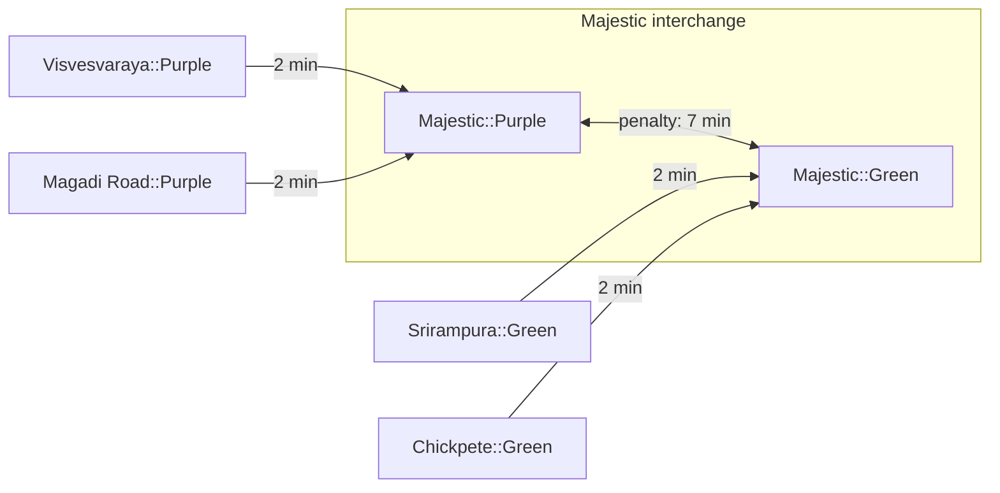
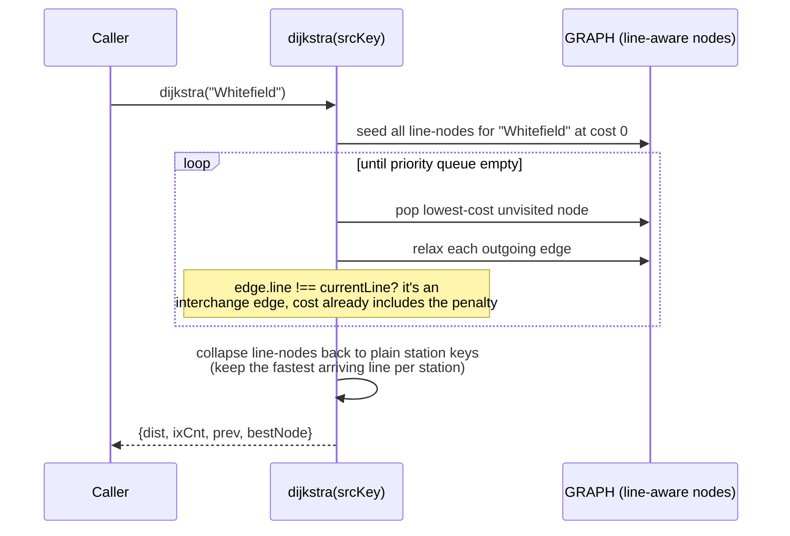

# Algorithms

## The graph

Every physical station that's served by more than one line (currently just
**Majestic** and **RV Road**) is represented internally as **one graph node per
line** — e.g. `"Majestic::Purple"` and `"Majestic::Green"` — connected by an
*interchange edge* carrying the transfer penalty. A station served by only one
line has a single node.

This is what lets interchange penalties fall out of the graph structure itself
instead of being hardcoded per station: a route that never actually changes
lines simply never touches an interchange edge.

## Dijkstra routing flow

`getRouteDetail(from, to, dResult)` then walks `prev`/`bestNode` to reconstruct
the actual path, lines used, fare, and interchange stations — it never
re-runs the search.

## Meetup optimization flow

```mermaid
flowchart TD
    A[friendStKeys: one station per friend] --> B[dijkstra&#40;k&#41; for every friend]
    B --> C{for every operational<br/>candidate station}
    C --> D[costs = each friend's<br/>travel time to candidate]
    D --> E["Travel Score = maxCost×2.5 + total×0.5"]
    D --> F["Fairness Score = spread²×3.0"]
    D --> G["Interchange Penalty = totalIx×8"]
    D --> H["Attractiveness Bonus =<br/>Station Attractiveness × weight"]
    E & F & G & H --> I["Final Score = Travel + Fairness<br/>+ Interchange − Attractiveness"]
    I --> J{lower than<br/>best so far?}
    J -->|yes| K[candidate becomes the new best]
    J -->|no| C
    K --> C
    C -->|all candidates checked| L[return best]
```

**Fairness is the primary objective** — the squared fairness term means a
station where everyone travels ~30 minutes scores much better than one where
one person travels 5 minutes and another travels 50, even though the second
has a lower *total*. Nearby hangout options only break near-ties; they never
override a meaningfully fairer or faster option.

## Complexity

| Function | Complexity | Notes |
|---|---|---|
| `buildGraph()` | O(S + E) | S = stations across all lines, E = edges produced. Runs once at load. |
| `dijkstra(src)` | O(V log V + E), array-PQ degrades toward O(V²) | V ≈ 90 line-aware nodes — negligible at this scale |
| `getRouteDetail()` | O(P) | P = hops in the reconstructed path |
| `findOptimal(friends)` | O(N × D) | N = operational stations (~82), D = one `dijkstra()` call |
| `calcFare()` | O(1) | Fixed tier lookup |

See [`api.md`](./api.md) for full function signatures and
[`diagnostics.md`](./diagnostics.md) for how these are regression-tested.
