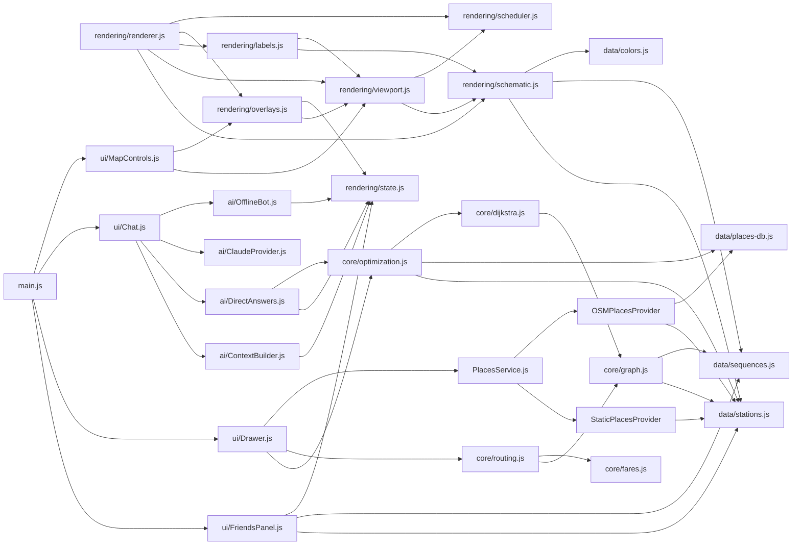

# Architecture

MetroMeet AI is a **single-page, build-tool-free application** written entirely in
native ES modules. There is no bundler, no framework, and no transpilation step —
`index.html` loads `src/main.js` via `<script type="module">`, and the browser
resolves every `import` directly over HTTP.

## Layered module structure

Dependencies flow in **one direction only**:

```
data → core → places → rendering → ai → ui → main
```

`diagnostics/` is the one exception: it may depend on *any* layer (it needs to
inspect the whole app), but nothing else is allowed to depend on it — this is
what makes it possible to strip Diagnostics out of a production build entirely
(see [`performance.md`](./performance.md)).

```mermaid
flowchart TB
    subgraph data["data/ — static station & line data"]
        stations[stations.js]
        sequences[sequences.js]
        placesdb[places-db.js]
        colors[colors.js]
    end

    subgraph core["core/ — routing & optimization algorithms"]
        graph[graph.js]
        dijkstra[dijkstra.js]
        routing[routing.js]
        fares[fares.js]
        optimization[optimization.js]
    end

    subgraph places["places/ — nearby-hangouts data layer"]
        placesservice[PlacesService.js]
        staticprov[StaticPlacesProvider]
        osmprov[OSMPlacesProvider]
        googleprov[GooglePlacesProvider]
    end

    subgraph rendering["rendering/ — schematic map engine"]
        schematic[schematic.js]
        viewport[viewport.js]
        scheduler[scheduler.js]
        labels[labels.js]
        overlays[overlays.js]
        renderer[renderer.js]
        state[state.js]
    end

    subgraph ai["ai/ — context-aware assistant"]
        contextbuilder[ContextBuilder.js]
        directanswers[DirectAnswers.js]
        claudeprovider[ClaudeProvider.js]
        offlinebot[OfflineBot.js]
    end

    subgraph ui["ui/ — DOM glue"]
        friendspanel[FriendsPanel.js]
        drawer[Drawer.js]
        chat[Chat.js]
        autocomplete[Autocomplete.js]
        mapcontrols[MapControls.js]
    end

    subgraph diag["diagnostics/ — dev-only, DEBUG-gated"]
        diagnostics[Diagnostics.js]
        perf[PerformanceMonitor.js]
        logger[Logger.js]
        errorboundary[ErrorBoundary.js]
    end

    main[main.js — entry point]

    data --> core --> places --> rendering --> ai --> ui --> main
    diag -.reads everything.-> data
    diag -.reads everything.-> core
    diag -.reads everything.-> places
    diag -.reads everything.-> rendering
    diag -.reads everything.-> ai
```

## Why no bundler?

The app is small enough (39 modules, ~3,500 lines) that native ES module
resolution is fast even unbundled, and it keeps the project trivially
inspectable — every file you open in the browser's Network tab is the exact
source file, unminified, un-transformed. See
[`deployment.md`](./deployment.md) for the trade-offs.

## Cross-cutting shared state

`rendering/state.js` holds mutable application state (`friends`, `vibe`,
`lastResult`, `meetContext`, `lastDisplayedPlaces`) that both `ai/` and `ui/`
need to read. It lives in `rendering/` — a layer both of those are already
allowed to depend on — specifically so that `rendering/overlays.js` (which
draws friend markers) never has to import from `ui/`, which would invert the
dependency direction above.

## Module dependency graph

A finer-grained view than the layer diagram above — every actual file-to-file
import edge (the same graph `scripts/verify.js` checks for cycles on every
`npm run verify`):



## "Find Best Meet Point" — end-to-end sequence

```mermaid
sequenceDiagram
    actor User
    participant UI as ui/Drawer.js
    participant Opt as core/optimization.js
    participant Dij as core/dijkstra.js
    participant Route as core/routing.js
    participant Places as places/PlacesService.js
    participant Render as rendering/renderer.js

    User->>UI: clicks "Find Best Meet Point"
    UI->>Opt: findOptimal(friendStKeys)
    loop for each friend
        Opt->>Dij: dijkstra(friendStation)
    end
    loop for each candidate station
        Opt->>Opt: score = travel + fairness + interchange − attractiveness
    end
    Opt-->>UI: best candidate
    loop for each friend
        UI->>Route: getRouteDetail(friend, best, dResult)
        Route-->>UI: {path, fare, interchanges, ...}
    end
    UI->>Render: requestRedraw() — meetup marker + friend markers
    UI->>Places: getNearbyPlacesForStation(best.key)
    Places-->>UI: normalized places (live or fallback)
    UI-->>User: drawer opens with routes, fares, and place cards
```

## Module index

| Folder | Responsibility | Docs |
|---|---|---|
| `data/` | Station coordinates, line sequences, curated places DB | — |
| `core/` | Graph construction, Dijkstra, route reconstruction, fares, meetup optimization | [`algorithms.md`](./algorithms.md) |
| `places/` | Pluggable nearby-places providers (static / OSM / Google stub) | [`places.md`](./places.md) |
| `rendering/` | Schematic map layout, viewport, caching, canvas draw pipeline | [`renderer.md`](./renderer.md) |
| `ai/` | Context snapshot, data-grounded direct answers, Claude fallback, offline bot | [`ai.md`](./ai.md) |
| `diagnostics/` | Automated test suite, performance monitor, logger, error boundaries | [`diagnostics.md`](./diagnostics.md), [`performance.md`](./performance.md) |
| `ui/` | DOM event wiring — friends panel, drawer, chat, autocomplete, map controls | — |
| `config/` | Feature flags, version metadata, shared constants | — |
| `utils/` | Small stateless helpers (geometry math) | — |

## Related documents

- [`algorithms.md`](./algorithms.md) — Dijkstra, fairness-first optimization
- [`renderer.md`](./renderer.md) — schematic map, caching layers
- [`places.md`](./places.md) — provider architecture
- [`ai.md`](./ai.md) — context-aware assistant pipeline
- [`diagnostics.md`](./diagnostics.md) — automated test suite
- [`performance.md`](./performance.md) — caching & instrumentation
- [`deployment.md`](./deployment.md) — Vercel / static hosting
- [`api.md`](./api.md) — public function reference
- [`portfolio.md`](./portfolio.md) — resume/LinkedIn copy, interview talking points
