# Diagnostics

A read-only, DEBUG-gated automated test suite covering every subsystem —
completely isolated from production logic.

## Enabling it

```js
// src/config/FeatureFlags.js
export const DEBUG = true;
```

`FEATURE_FLAGS.DIAGNOSTICS` must also be `true` (it is, by default). With
both set, reload the app and run in the browser console:

```js
await runDiagnostics()
```

With `DEBUG=false` (the shipped default), `diagnostics/Diagnostics.js` is
**never even imported** — `main.js` loads it via a dynamic `import()` gated
on that same condition, so its code isn't fetched or parsed at all in
production, not just "not run."

## Pipeline

```mermaid
flowchart TD
    A["main.js: window 'load' event"] --> B{DEBUG &&<br/>FEATURE_FLAGS.DIAGNOSTICS?}
    B -->|no| Z[Diagnostics never imported]
    B -->|yes| C["import&#40;'./diagnostics/Diagnostics.js'&#41;"]
    C --> D[test registry populated<br/>— 6 suites, 29 tests]
    D --> E["window.runDiagnostics&#40;&#41; exposed"]
    E --> F[developer calls runDiagnostics&#40;&#41;]
    F --> G[run every registered test in order]
    G --> H{pass or fail?}
    H -->|pass| I[✓ recorded]
    H -->|fail — exception caught| J[✗ recorded with error message]
    I & J --> K[print report: pass/fail counts,<br/>per-suite coverage, timings]
```



## Coverage (29 tests across 6 suites)

| Suite | Tests |
|---|---|
| **Graph** | Every edge is bidirectional · no orphan stations · all stations reachable · interchange consistency · no duplicate edges |
| **Routing** | Shortest-path cost matches a known adjacent stop · fare tiers · route reconstruction start/end · same-line trip reports zero interchanges (regression test) · cross-line trip reports the right hub |
| **Optimization** | Internally consistent stats · longest traveler identifiable · attractiveness bonus = attractiveness × weight · deterministic ranking |
| **Places** | Cache avoids a second live call · fallback to static on failure · normalized shape has all fields · category filtering |
| **Renderer** | Station/line coverage · interchange alignment · label layout has no overlaps · viewport transform round-trips |
| **AI** | Context builder shape · direct-answer recognition · Claude failure surfaces correctly · offline fallback always returns something |

## Design principles

- **Read-only**: tests only observe existing state/functions, or (for a
  handful of cases) temporarily stub `globalThis.fetch` — always restored in
  a `finally` block, with any synthetic test data cleaned up afterward.
- **Zero production coupling**: nothing in `core/`, `places/`, `rendering/`,
  or `ai/` imports from `diagnostics/Diagnostics.js` — the dependency only
  goes the other way.
- **Non-invasive timing**: a handful of entry points (`dijkstra`,
  `findOptimal`, `getNearbyPlacesForStation`, `buildAppContext`,
  `performDraw`) are wrapped *by reference*, from within their own owning
  module, gated by the same `DEBUG && FEATURE_FLAGS.DIAGNOSTICS` check — see
  [`performance.md`](./performance.md).
