# Places Provider Architecture

"Nearby hangouts" data (cafes, restaurants, malls, parks, arcades, bars) comes
from a small set of interchangeable providers behind one shared interface:

```js
async getNearbyPlaces(stationKey, categories) -> NormalizedPlace[]
```

```js
NormalizedPlace = { name, category, latitude, longitude, rating, distance, source }
```

## Providers

| Provider | File | Behavior |
|---|---|---|
| `StaticPlacesProvider` | `places/providers/StaticPlacesProvider.js` | Curated hand-written database (`data/places-db.js`). Always succeeds — this is the fallback every other provider degrades to. |
| `OSMPlacesProvider` | `places/providers/OSMPlacesProvider.js` | Live query against the OpenStreetMap Overpass API, centered on the station's real coordinates. |
| `GooglePlacesProvider` | `places/providers/GooglePlacesProvider.js` | Stub — throws `not implemented yet`. Wire up an API key + Nearby Search call to enable it. |

## Lookup pipeline

```mermaid
flowchart TD
    A["fetchPlaces&#40;station&#41;"] --> B{FEATURE_FLAGS.LIVE_PLACES?}
    B -->|off| S[StaticPlacesProvider directly]
    B -->|on| C["getNearbyPlacesForStation&#40;station&#41;"]
    C --> D{cached for<br/>this station?}
    D -->|yes| E[return cached Promise — no network call]
    D -->|no| F[try LIVE_NEARBY_PROVIDER<br/>&#40;OSMPlacesProvider&#41;]
    F --> G{succeeded with<br/>results?}
    G -->|yes| H[cache + return]
    G -->|no / threw / empty| I[fall back to StaticPlacesProvider]
    I --> H
    S --> J[render place cards]
    H --> J
```



## Caching

`getNearbyPlacesForStation()` caches the **full, all-categories** result per
station as a `Promise` — switching the vibe filter (Cafe / Mall / Bar / …)
never triggers a new network request, it just filters what's already cached.

## Adding a new provider

1. Create `places/providers/YourProvider.js` implementing `getNearbyPlaces()`.
2. Register it in `NEARBY_PLACE_PROVIDERS` inside `places/PlacesService.js`.
3. Optionally set `LIVE_NEARBY_PROVIDER` to its key.

No other file needs to change — the registry pattern is the extension point.

## Verified by Diagnostics

The `Places` suite (see [`diagnostics.md`](./diagnostics.md)) checks: cache
avoids a second live call for the same station, automatic fallback on live
failure, every returned place has all required normalized fields, and
category filtering returns only the requested category.
