# Rendering Engine

The map is a schematic (BMRCL-style) diagram — evenly spaced by *stop count*,
not real geographic distance — rendered on an HTML `<canvas>`, with a caching
strategy specifically built to avoid redundant work on every frame.

## Layers

1. **Static bitmap** (`renderStaticLayer`) — background, grid, all metro
   lines, all station dots, all visible labels. Drawn to an *offscreen*
   canvas.
2. **Dynamic overlays** (`overlays.js`) — hover ring, friend markers, meetup
   marker. Drawn directly to the visible canvas, every frame, on top of the
   (possibly reused) static bitmap.

```mermaid
flowchart TD
    A[requestRedraw&#40;&#41; called] --> B{already a frame<br/>scheduled?}
    B -->|yes| Z[no-op — coalesced]
    B -->|no| C[requestAnimationFrame]
    C --> D[performDraw&#40;&#41;]
    D --> E{viewport key<br/>&#40;pan+zoom+size&#41; changed<br/>since last frame?}
    E -->|no, and RENDER_CACHE on| F[reuse cached static bitmap]
    E -->|yes, or RENDER_CACHE off| G[renderStaticLayer&#40;&#41;<br/>redraw grid+lines+stations+labels]
    G --> H[cache the new bitmap + dot positions]
    F --> I[blit static bitmap to visible canvas]
    H --> I
    I --> J[drawHoverOverlay]
    J --> K[drawFriendMarkers]
    K --> L[drawMeetupMarker]
    L --> M[frame done]
```

## Label placement caching

Collision-avoidance label placement is computed in **pan-independent pixel
space** — translating the whole map doesn't change which labels overlap or
which offset (above/below/left/right) was chosen for each one, only zoom and
canvas size do. So `getLabelLayout()` caches its result keyed by
`(scale, width, height)`, and a pure pan (the most common interaction) never
re-runs collision detection at all.

## Schematic coordinate system

Real station coordinates are converted **once**, at load time, into an
abstract 0–1000 grid via `buildSchematicCoords()`. Each line is defined by a
handful of hand-placed **checkpoint** anchors (termini, bends, interchanges);
every station between two checkpoints is spaced evenly by stop count. Shared
interchange stations resolve to the *exact same coordinate* regardless of
which line's checkpoints produced them — verified by
[Diagnostics](./diagnostics.md)'s Renderer suite.

## Error resilience

`performDraw` is wrapped (by reference, not by editing its own body) with a
try/catch that logs via `Logger.error` instead of throwing — a single bad
frame (e.g. a transient canvas API failure) never breaks every subsequent
redraw. See [`performance.md`](./performance.md) for the rest of the
instrumentation.

## Future extensibility

Each dynamic overlay is an independent function called from `performDraw()`.
A future animated-train or live-vehicle-position layer would be one more such
function — it wouldn't need to touch the static layer, the scheduler, or any
existing overlay.
